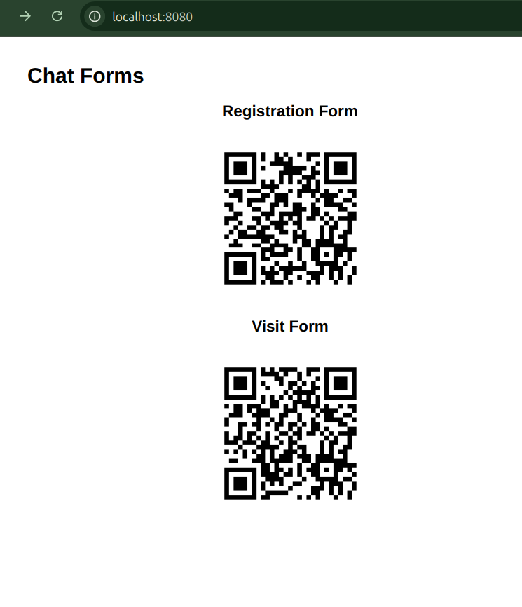

# AI Chat Forms

A web application that uses AI to guide users through form completion in multiple languages. The AI assistant maintains context between forms and handles natural language input, making form filling more conversational and user-friendly.



## Key Features

- **Conversational Form Filling**: Uses AI to guide users through forms naturally
- **Multi-language Support**: Automatically detects and responds in the user's language
- **Context Awareness**: Maintains user context between related forms
- **QR Code Access**: Generates QR codes for easy mobile form access
- **Flexible Configuration**: All forms and behavior configured via XML

## How It Works

### Configuration

The application is configured via `configuration.xml`, which defines:

1. **System Settings**:
   - AI model configuration
   - Server binding address
   - Base URL
   - System prompt for AI behavior

2. **Forms**:
   Each form defines:
   - Primary key (for data storage and linking)
   - Context form (for loading previous form data)
   - Form fields with examples
   - Custom system prompts

Example form configuration:
```xml
<form name="registration">
    <primary_key>License</primary_key>
    <context_form></context_form>
    <form_fields>
        FirstName: {{.FirstName}} (like John)
        LastName: {{.LastName}} (like Smith)
        License: {{.License}} (like 555-55-5555)
    </form_fields>
</form>
```

### AI Communication Protocol

The AI uses a command-based protocol:
- `SAY`: Display message to user
- `SET`: Set form field value
- `SAVE`: Save current form data

Example AI response:
```
SET FirstName John
SET LastName Doe
SAY What is your phone number?
```

### Data Flow

1. User starts with registration form
2. AI collects and saves registration data
3. Registration data stored as `forms/registration-{License}.json`
4. License stored in cookie
5. Visit form loads registration data using License cookie
6. AI personalizes interaction using context data

## Running the Application

1. Install Go
2. Configure `configuration.xml`
3. Run:
```bash
go run main.go
```
4. Access at `http://localhost:8080`

## Implementation Details

The application:
1. Serves a home page with QR codes for each form
2. Maintains chat sessions per form
3. Stores form data in JSON files
4. Uses cookies to link related forms
5. Passes context between forms using primary keys

### Key Components

- **Form Templates**: HTML templates for form display
- **Chat Handler**: Processes AI communication
- **Context Management**: Loads related form data
- **Data Storage**: JSON-based form storage
- **Session Management**: Cookie-based user tracking

## Example Use Case: Medical Office

1. Patient scans QR code for registration
2. AI collects patient information conversationally
3. Data saved with License as key
4. Patient moves to visit form
5. AI greets patient by name, pre-fills known info
6. Collects visit-specific information
7. Links visit to registration via License

## Design Principles

1. **Configuration over Code**: Forms defined in XML
2. **Stateless Design**: Data stored in files, context in cookies
3. **Natural Interaction**: AI handles language/format conversion
4. **Progressive Enhancement**: Forms work with/without JS
5. **Context Preservation**: Data flows between related forms

## Security Notes

- Store sensitive data appropriately
- Validate all user input
- Secure cookie handling
- Protect form data files
- Rate limit AI requests

## Extending the Application

To add new forms:
1. Add form configuration to XML
2. Define fields and examples
3. Set primary key and context relationships
4. Update system prompts
5. Add to home page template

The AI will automatically handle the new form based on the configuration.
